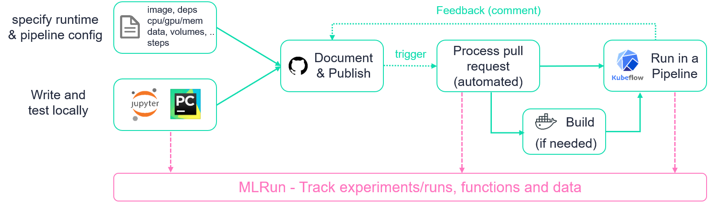
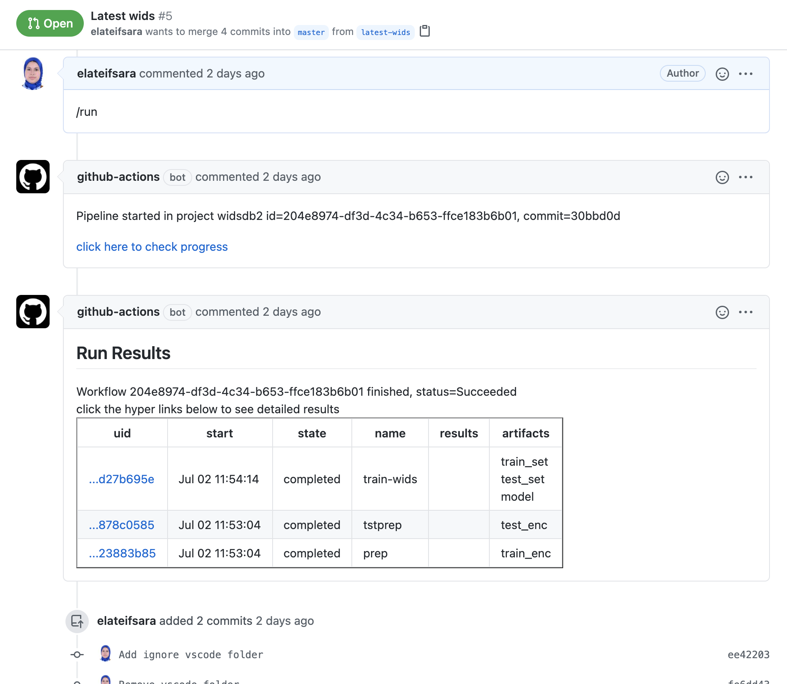
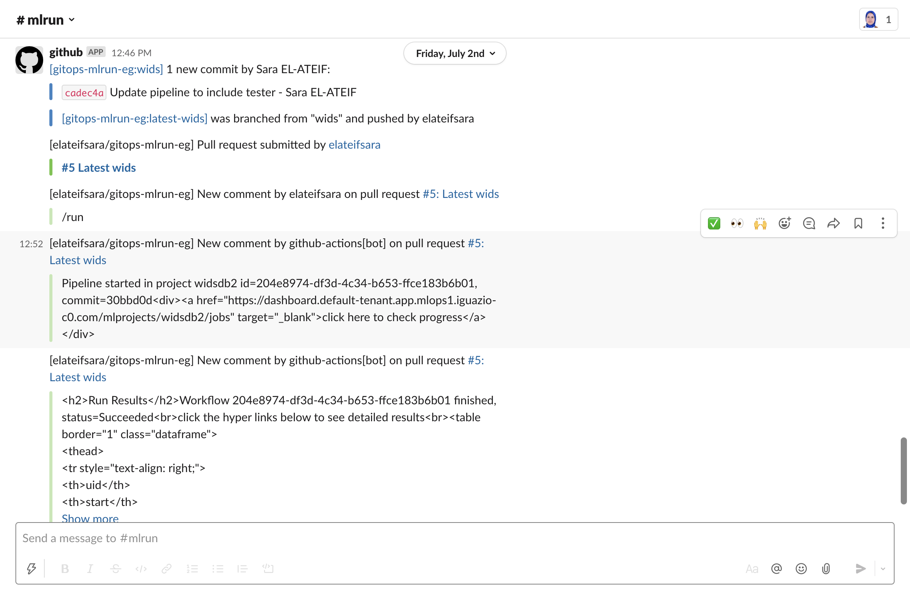
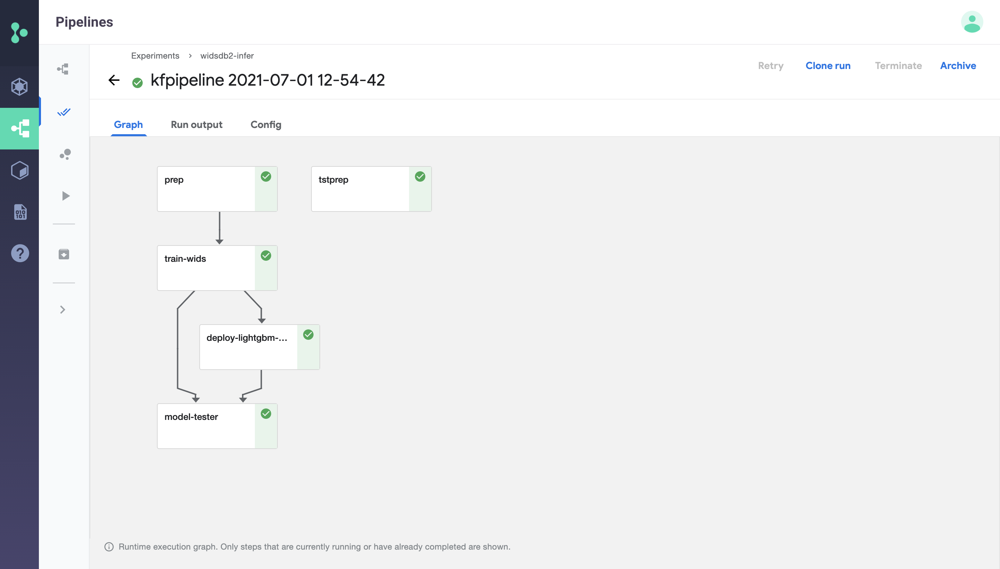
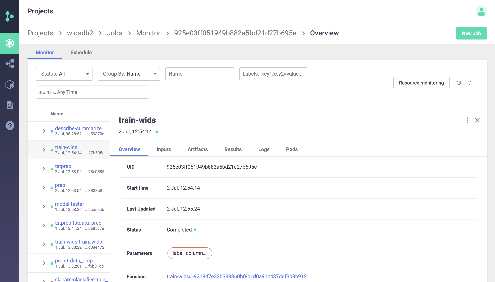

# About the project ICU-Ops

## Goal

Help frontline clinicians triage patients in ICUs by rapidly assessing a patient's overall health for informed clinical decisions that will improve patient outcomes and relieve COVID19 ICU overload.
## Details

We used the WIDS 2021 dataset, which focuses on patient health, with an emphasis on the chronic condition of diabetes. An ICU patient's chronic conditions, such as heart disease, injuries, or diabetes, may not be readily available due to the patient's condition or if the patient is from another medical provider or system. Knowing a patient's chronic diseases can expedite clinical decisions about their care and ultimately improve their health outcomes. The speed-up of patient outcomes relieves Intensive Care Units (ICUs) struggling with overload from critical COVID-19 pandemic cases. Our AI solution, ICU-OPS, is rapidly channeling medical emergencies in the right hands, leading to the best possible patient outcomes.

## Team and project

You can find out more about the project and team by following [this link](https://devpost.com/software/child-safety).

 

 
# About the pipeline
## ML Pipeline Automation and CI/CD Using GitHub Actions, Kubeflow and MLRun

Machine learning (ML) pipelines allow us to automate multi-stage workflow which comprise of 
data ingestion, data preparation, model training, validation and finally deployment.

Every time our code, data or parameters change we may want to re-evaluate our model accuracy and performance before we deploy.
This resembles the CI/CD practice for delivering code to production with the additional aspects of data and parameter/configuration versioning.

## How Does It Work?

This repo is representing an **mlrun project**, mlrun projects consists of **Functions** (code), **Artifacts** (data), **Workflows**, and **Parameters/secrets**. 
The [**project.yaml**](project.yaml) file list all of those elements.

When we change one of the elements (the project.yaml file or one of the other linked code/metadata files) and open a pull request (PR)
we can type `/run` in our PR, this will trigger running the ML Pipeline (as specified in the [workflow file](workflow.py)).
Once the pipeline starts, a comment will be added to your PR with a link to MLRun UI (allowing to track the progress), and when the ML Pipeline completes
MLRUn will write a result summary as a comment back into your PR with links to more details and data artifacts

**Flow diagram:**

 

 

**This is an example of the PR comments:**

 

  

**This is an example of the summary report sent to `Slack`:**

 

  

**The Kubeflow pipeline graph**

 

 

**MLRun UI showing the AutoML results (linked to from the PR)**

 

 

## What Is MLRun? 

MLRun is the first and currently only integrated open-source framework for end to end MLOps automation, it:
* Orchestrates job/pipeline from simple code or pre-baked functions (via Kubeflow and various k8s CRDs) 
* Runs, tracks and version projects comprising of experiments, jobs/functions, data, code, models and more.
* Provides an open marketplace for various ML, DL, Analytics, MLOps functions  
* Runs iterative AutoML, Hyper-param, or data analysis tasks on a distributed cluster  
* Automates deployment of models and real-time data processing functions using (Nuclio) real-time serverless engine 

Read more in [mlrun/mlrun](https://github.com/mlrun/mlrun)

## Resources

This is based on the [official GitOps tutorial](https://github.com/mlrun/demo-github-actions).
